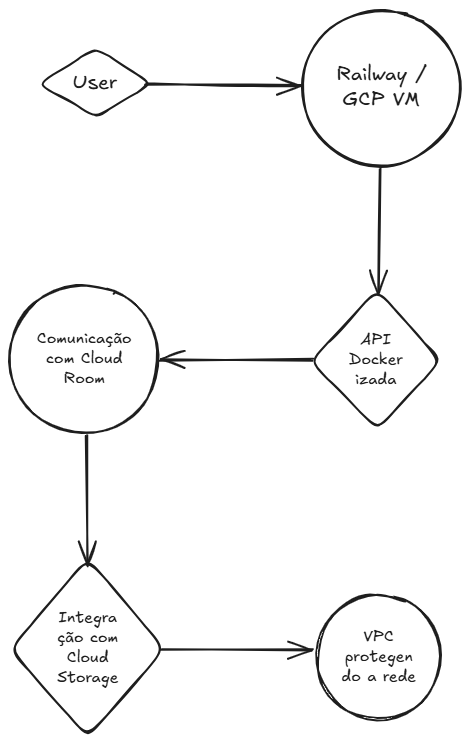

# 🏗️ InfraRoom — Arquitetura GCP-like com Docker, Fastify e Comunicação entre Serviços

[](https://nodejs.org/)
[](https://www.fastify.io/)
[](https://www.docker.com/)
[](https://railway.app/)
[]()

> InfraRoom é uma API Node.js + Fastify dockerizada que simula uma infraestrutura em nuvem GCP-like.
> O projeto foi arquitetado para representar uma VM se comunicando com um serviço externo (Cloud Run), ambos isolados via rede Docker (VPC simulada), e com plano de expansão real para GCP.

---

## ⚙️ Tecnologias Utilizadas

- ⚡ Fastify — framework leve e rápido para Node.js
- 🐳 Docker — empacotamento e rede isolada entre containers
- 🔁 Axios — comunicação HTTP entre serviços
- ☁️ Railway — deploy temporário
- 🔐 Arquitetura GCP-like: VM (Compute), Cloud Run, VPC, Storage
- 🧪 Tap — testes automatizados
- 🗺️ Excalidraw — diagrama visual da arquitetura

---

## 🔌 Endpoints disponíveis

| Serviço           | Método | Rota             | Descrição                                     |
|------------------|--------|------------------|-----------------------------------------------|
| InfraRoom (VM)   | GET    | `/`              | Mensagem de boas-vindas                       |
| InfraRoom (VM)   | GET    | `/cloud-room`    | Consulta o microserviço Cloud Run simulado    |
| Cloud Run Mock   | GET    | `/external-data` | Resposta do microserviço separado             |

---

## 🧱 Arquitetura Simulada (GCP-Like)



> Comunicação entre containers Docker simula:
>
> - VM rodando Node.js
> - Serviço externo estilo Cloud Run
> - Rede isolada simulando VPC
> - Comunicação segura interna

---

## ▶️ Como rodar localmente

```bash
# 1. Clonar o projeto
git clone https://github.com/WallanDavid/infraroom.git
cd infraroom/infraroom

# 2. Instalar dependências do serviço principal (opcional, só se alterar)
npm install

# 3. Subir os containers (inclui VM e Cloud Run simulado)
docker-compose build
docker-compose up

Acesse:

http://localhost:3000/ → API principal (VM)

http://localhost:3000/cloud-room → Comunicação entre serviços

http://localhost:4000/external-data → Serviço Cloud Run simulado

🧪 Testes Automatizados
npm test

Testes criados com tap

Cobertura funcional dos endpoints

Pode ser expandido com GitHub Actions


📦 Estrutura de Arquivos
infraroom/
├── cloud-run-service/
│   ├── Dockerfile
│   ├── server.js
│   └── package.json
├── docs/
│   └── infra-architecture.png
├── tests/
│   └── server.test.js
├── Dockerfile
├── docker-compose.yml
├── server.js
├── storage.js
├── infra.md
├── .env.example
└── README.md


☁️ Plano de Expansão para GCP
 Simulação local de VM (Compute Engine)

 Microserviço separado simulando Cloud Run

 Comunicação isolada por rede Docker (VPC simulada)

 Armazenamento com mock do Cloud Storage

 Possível migração 1:1 para ambiente real GCP

✍️ Autor
Feito com 💻 por Wallan David
🔗 Projeto open-source sob licença MIT
