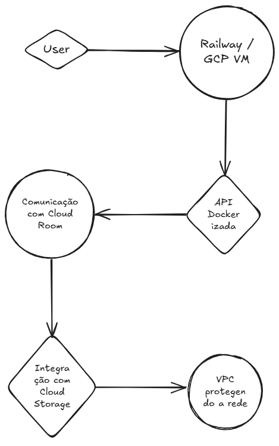

# InfraRoom - Etapas de Expansão para Produção

## 1. Provisionamento de VM (GCP Compute Engine)
- Ubuntu 22.04 LTS
- Deploy Docker da API
- Configuração de firewall e regras de acesso

## 2. Integração com Cloud Storage
- Armazenamento de arquivos públicos/logs
- Conexão via SDK Node.js

## 3. Rede Segura
- Criação de VPC
- VPN simulada ou real
- Controle de entrada/saída por sub-rede

## 4. Deploy Automatizado
- GitHub Actions (CI/CD)
- Build e push automático na VM

## 5. Monitoramento e Logs
- Stackdriver (GCP)
- Logs centralizados e métricas

## 6. Backup + Escalabilidade
- Snapshots de VM
- Configuração futura de Load Balancer

